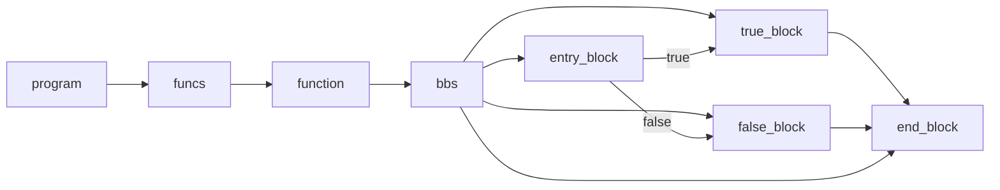

# 编译原理实践-SysY2RISC-V(C++)

## 概述

1. 将SysY程序转换为内存形式的Koopa IR
2. 将Koopa IR转换为RISC-V汇编程序

## 得分

- Koopa 100/100
- RISC-V 100/100

## 优化

本地测试：566.7s

- [ ] 寄存器分配
- [ ] 常量传播
- [ ] 函数内联
- [ ] 控制流简化
- [ ] 循环展开
- [ ] 强度削弱
- [ ] 窥孔优化
- [ ] SSA形式

## 内存形式Koopa IR C++接口文档

鉴于Koopa IR的C++接口文档并不完善，加之本人觉得实现一个内存形式的IR无论是从对IR设计的理解或者是编码的体验来说都优于生成文本形式的IR，在此根据完成实践中的记录做补充（小白向，大佬请忽略x

### lv1

lv1中我们将要用到

- koopa_raw_slice_t：是Koopa IR中的数组类型，有三个属性，分别是：
  - buffer：以void*类型存储数组中的元素
  - len：数组的大小
  - koopa_raw_slice_item_kind_t：数组的类型，lv1中只会用到FUNCTION,BASIC_BLOCK,VALUE
- koopa_raw_type_t：是Koopa IR中的类型，有两个属性，分别是：
  - tag：类型的种类，lv1中只会用到INT,FUNCTION
  - data：类型对应的数据，lv1中只会用到FUNCTION，data.function中有两个属性，分别是：
    - ret：函数的返回值类型
    - params：函数的参数类型
  lv8之前只会用到ret
- koopa_raw_program_t：是Koopa IR中的程序，有两个属性，分别是：
  - values：全局属性列表
  - funcs：函数列表
  lv8之前只会用到funcs
- koopa_raw_basic_block_t：是Koopa IR中的基本块，有四个属性，分别是：
  - name：基本块的名字
  - used_by：基本块被哪些函数使用
  - params：基本块的参数
  - insts：基本块中的指令列表
  不做优化的话used_by和params将不会被使用
- koopa_raw_function_t：是Koopa IR中的函数，有四个属性，分别是：
  - name：函数的名字
  - ty：函数的类型（包括参数的类型和返回值的类型）
  - params：函数的参数列表
  - bbs：函数的基本块列表
  lv8之前不会用到params
- koopa_raw_value_t：是Koopa IR中的值，有四个属性，分别是：
  - name：值的名字
  - ty：值的类型
  - used_by：值被哪些值使用
  - kind：值的数据，kind下有两个属性，分别是：
    - tag：标识应该访问哪个数据域
    - data：数据域，有多种类型，lv1中只会用到integer和ret
- koopa_raw_integer_t：是Koopa IR中的整数，有一个属性，即整数的值，属性类型为int
- koopa_raw_return_t：是Koopa IR中的返回值，有一个属性，即返回值的值，注意该属性的类型是koopa_raw_value_t，而不是koopa_raw_integer_t

> [!TIP]
> 根据以上不难看出，我们需要定义一个slice函数，用来创建一个空的slice（即使为空在生成Koopa IR时也需要有这个属性），或者将一个vector<const void *>转换为slice，以及一个用来创建koopa_raw_type_t的函数，用来为各种各样的指令、函数来生成对应的类型。

> [!IMPORTANT]
> 在lv1中，我们应该先定义一个程序，然后向其funcs中添加函数，再向函数的bbs中添加基本块，最后向基本块的insts中添加指令，该生成什么指令和SysY代码相关，这个流程在lv6之前都是一样的。

由于lv1中只有一个函数和一个基本块，我们的IR应该类似于如下结构：


对于slice的生成，类似于如下代码：

```c++
koopa_raw_slice_t ret;
ret.kind = kind; // kind是一个koopa_raw_slice_item_kind_t，代表数组的类型
ret.buffer = new const void *[vec.size()]; // buffer初始化
std::copy(vec.begin(), vec.end(), ret.buffer); // 将vec中的元素复制到buffer中，vec是一个vector<const void *>
ret.len = vec.size();
```

对于ret_value的生成，类似于如下代码：

```c++
koopa_raw_value_t ret_value;
ret_value.name = nullptr;
ret_value.ty = type(); // type()是一个返回koopa_raw_type_t的函数，此处应该返回一个INT32类型
ret_value.used_by = slice(); // slice()是一个返回koopa_raw_slice_t的函数，此处应该返回一个空的slice
ret_value.kind.tag = KOOPA_RVT_RETURN;
ret_value.kind.data.ret = int_value; // int_value是一个koopa_raw_value_t
```

对于int_value的生成，类似于如下代码：

```c++
koopa_raw_value_t int_value;
int_value.name = nullptr;
int_value.ty = type(); // type()是一个返回koopa_raw_type_t的函数，此处应该返回一个INT32类型
int_value.used_by = slice(); // slice()是一个返回koopa_raw_slice_t的函数，此处应该返回一个空的slice
int_value.kind.tag = KOOPA_RVT_INTEGER;
int_value.kind.data.integer = val; // val是一个int
```

对于函数的生成，类似于如下代码：

```c++
koopa_raw_function_t function;
function.name = name; // name是一个const char *，如果你在词法分析时转换为了std::string，不要忘了转换为const char *时在末尾添加'\0'
function.ty = type(); // type()是一个返回koopa_raw_type_t的函数，此处应该返回一个函数类型，即ret为INT32，params为空，总体为FUNCTION
function.params = slice(); // slice()是一个返回koopa_raw_slice_t的函数，此处应该返回一个空的slice
function.bbs = slice(); // slice()是一个返回koopa_raw_slice_t的函数，此处应该返回只有一个基本块的slice
```

关于基本块、程序以及更多细节部分的生成，你不难通过上面的例子推断出来。

> [!WARNING]
> 当完成了raw的生成之后，你需要将其转换为Koopa IR，这里需要用到koopa_generate_raw_to_koopa，该函数可能会返回一些错误，通过查看koopa_error_code_t的定义，你可以知道这些错误的含义。在成功生成Koopa IR后，调用koopa_dump_to_file将其输出到文件中。

### lv2

lv2中并没有与Koopa IR生成的相关内容.

> [!NOTE]
> 这里强烈建议使用koopa_dump_to_string将生成的Koopa IR转换为字符串，再调用koopa_parse_from_string将其转换为Koopa IR，这样的操作现在来看是多余的，但是在后面的实现中，这样的流程可以自动帮你处理好属性名、基本块名重复的问题，而不需要你手动处理。

### lv3

lv3中新增了表达式计算，对应了koopa_raw_binary_t，它有以下三个属性：

- op：类型为koopa_raw_binary_op_t，指示了运算的类型，具体的类型可以查看注释
- lhs：类型为koopa_raw_value_t，指示了左操作数
- rhs：类型为koopa_raw_value_t，指示了右操作数

> [!TIP]
> 了解这个结构之后不难看出，创建一个二元运算的过程是解析AST得到运算类型，然后创建lhs和rhs对应的value，最后创建一个binary，将这三个属性填入即可。
> 
> 例如对于（2-1）*3，你需要创建一个binary，op为\*，lhs为一个binary，op为KOOPA_RBO_SUB，lhs为一个integer，值为2；rhs为一个integer，值为1；rhs为一个integer，值为3。


> [!CAUTION]
> 要注意的是，对于一元运算-和!(+不用生成IR)，你需要将其转换为二元运算，例如-1应该转换为0-1，!1应该转换为1==0，这样才能正确生成IR。此外，对于逻辑运算符&&和||，Koopa IR的KOOPA_RBO_AND和KOOPA_RBO_OR是bitwise的，而不是logical的，你需要将lhs和rhs转换为0或1，然后再进行运算。如果顺利编码到此，你不难想到如何进行转换。

### lv4

常量部分的生成没有任何新的添加，变量部分的生成新增了三个value，分别是alloc、load和store，它们的结构如下：

- alloc：alloc没有对应的数据域，只需要将kind.tag设为KOOPA_RVT_ALLOC，只有两个需要使用的属性，分别是：
  - name：alloc的名字，Koopa IR不用处理重名问题，直接设置为@+变量名即可
  - ty：alloc的类型，应该与变量的类型相同，在lv9之前，变量的类型只有INT32
- load：load的数据域为koopa_raw_load_t，有一个属性，是：
  - src：load的源，类型为koopa_raw_value_t
- store：store的数据域为koopa_raw_store_t，有两个属性，分别是：
  - dest：store的目的地，类型为koopa_raw_value_t
  - value：store的值，类型为koopa_raw_value_t

> [!TIP]
> 了解了以上定义后，不难推断出，当遇到变量的定义时，你需要创建一个alloc，当遇到变量的使用时，你需要创建一个load，src为该alloc指令，当遇到变量的赋值时，你需要创建一个store，dest为该alloc指令，value为赋值的值。
>
> 例如对于int a = 1;，你需要创建一个alloc，名字为@a，类型为INT32，然后创建一个store，dest为@a，然后创建一个integer，值为1，就完成了对a的定义和赋值。
> 
> 而对于a = a + 1;，你需要创建一个load，src为@a，然后创建一个binary，op为KOOPA_RBO_ADD，lhs为load，rhs为integer，值为1，然后创建一个store，dest为@a，value为binary，就完成了对a的计算和赋值。

> [!IMPORTANT]
> 由于load和store的src和dest都是alloc value，所以对于符号表的创建，在符号表中保存koopa_raw_value_t是一个不错的选择。

### lv5

这一小节新增了作用域的概念，此处的语句块只涉及到作用域的嵌套，所以不用添加多个基本块，只需要维护好符号表即可。由于Koopa IR能自动处理变量名重复的问题，所以你并不需要处理重名问题，例如遇到多个a，你可以直接将其名字都设置为@a，而不需要将其名字设置为@a1，@a2等。

### lv6

这一小节新增了if语句，涉及到了控制流的转移，所以你的程序并不再像lv1中所说只有一个基本块，而是有多个基本块，你的程序应该类似于如下结构：



当然bbs到每个基本块的箭头只是说明这些基本块都存储在bbs中，程序依然是从entry_block开始执行的。

Koopa IR中的控制流转移有以下几种：
- br: 条件分支，有五个属性，分别是：
  - cond：条件，类型为koopa_raw_value_t
  - true_block：条件为真时跳转的基本块，类型为koopa_raw_basic_block_t
  - false_block：条件为假时跳转的基本块，类型为koopa_raw_basic_block_t
  - true_args：条件为真时跳转的基本块的参数，类型为koopa_raw_slice_t，不做SSA优化不会用到
  - false_args：条件为假时跳转的基本块的参数，类型为koopa_raw_slice_t，不做SSA优化不会用到
- jump: 无条件跳转，有三个属性，分别是：
  - target：跳转的基本块，类型为koopa_raw_basic_block_t
  - args：跳转的基本块的参数，类型为koopa_raw_slice_t，不做SSA优化不会用到

> [!TIP]
> 了解了以上定义后，不难推断出，当遇到if语句时，你需要创建一个br，cond为if的条件，true_block为if的true_block，false_block为if的false_block，当遇到true_block结尾，你需要创建一个jump，target为if的end_block，当遇到false_block结尾，你需要创建一个jump，target为if的end_block。

> [!IMPORTANT]
> 在此处由于基本块的增多，你应该创建某种数据结构来存放所有的基本块，以及指出现在生成的指令应该保存在哪个基本块中，这样会大大减小coding的难度。